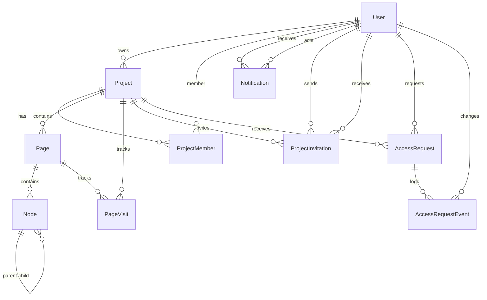

# Database Design

## ORM

Prisma 7.7 with PostgreSQL. The adapter uses `@prisma/adapter-pg` with a `pg` connection pool (max 5 connections).

## Entity Relationship Diagram

## Table Documentation

### User

| Column | Type | Constraints | Description |
|--------|------|-------------|-------------|
| id | String | PK | Clerk user ID (external) |
| email | String | UNIQUE, NOT NULL | Primary email |
| firstName | String? | nullable | |
| lastName | String? | nullable | |
| displayName | String? | nullable | Custom display name |
| username | String? | UNIQUE | Unique username |
| bio | String? | nullable | |
| imageUrl | String? | nullable | Profile image |
| isOnline | Boolean | default false | Online status |
| lastActiveAt | DateTime? | nullable | Last activity timestamp |
| profileVisibility | ProfileVisibility | default public | public / private |
| showEmail | Boolean | default false | |

**Relationships**: Projects (owned), Memberships, Notifications (received/actor), Invitations (sent/received), AccessRequests, AccessRequestEvents

**Indexes**: `id` (PK), `email` (unique), `username` (unique)

### Project

| Column | Type | Constraints | Description |
|--------|------|-------------|-------------|
| id | String | PK, cuid | |
| name | String | NOT NULL | |
| description | String? | nullable | |
| thumbnail | String? | nullable | |
| ownerId | String | FK → User.id | |
| visibility | ProjectVisibility | default public | public / private |
| createdAt | DateTime | auto | |
| updatedAt | DateTime | auto | |

**Relationships**: Owner (User), Members, Pages, PageVisits, Invitations, AccessRequests

**Cascade**: `onDelete: Cascade` on ownerId — deleting a user deletes their projects

**Indexes**: `ownerId`

### Page

| Column | Type | Constraints | Description |
|--------|------|-------------|-------------|
| id | String | PK, cuid | |
| name | String | default "Page 1" | |
| order | Int | default 0 | Display order within project |
| projectId | String | FK → Project.id | |
| createdAt | DateTime | auto | |
| updatedAt | DateTime | auto | |

**Relationships**: Project (parent), Nodes (children), PageVisits

**Cascade**: `onDelete: Cascade` on projectId

**Indexes**: `projectId`

### Node

| Column | Type | Constraints | Description |
|--------|------|-------------|-------------|
| id | String | PK, cuid | |
| parentId | String? | FK → Node.id | Parent for grouping |
| pageId | String | FK → Page.id | |
| type | NodeType | NOT NULL | rect, circle, text, frame, star, diamond, image |
| x, y | Float | NOT NULL | Position |
| width, height | Float | NOT NULL | Size |
| radius | Float | default 0 | |
| text | String? | nullable | Text content |
| fill | String | default #ffffff | Fill color |
| stroke | String | default #000000 | Stroke color |
| strokeWidth | Float | default 1 | |
| strokeStyle | StrokeStyle | default solid | solid / dashed |
| rotation | Float | default 0 | |
| opacity | Float | default 1 | |
| fontSize | Float | default 14 | |
| fontFamily | String | default Arial | |
| zIndex | Int | default 0 | Layer ordering |
| imageUrl | String? | nullable | |
| points | Float[] | | For line/polyline nodes |

**Relationships**: Page (parent), Parent Node (self-referencing), Child Nodes (self-referencing)

**Cascade**: `onDelete: Cascade` on both pageId and parentId

**Indexes**: `pageId`, `parentId`

### ProjectMember

| Column | Type | Constraints | Description |
|--------|------|-------------|-------------|
| id | String | PK, cuid | |
| projectId | String | FK → Project.id | |
| userId | String | FK → User.id | |
| role | MemberRole | default editor | owner / editor / viewer |
| joinedAt | DateTime | auto | |
| favoritedAt | DateTime? | nullable | |
| archivedAt | DateTime? | nullable | |
| lastOpenedAt | DateTime? | nullable | |
| pinnedAt | DateTime? | nullable | |

**Unique Constraint**: `@@unique([projectId, userId])` — one membership per user per project

**Cascade**: `onDelete: Cascade` on both projectId and userId

**Indexes**: `userId`, `projectId`, `archivedAt`, `favoritedAt`, `pinnedAt`

### PageVisit

| Column | Type | Constraints | Description |
|--------|------|-------------|-------------|
| id | String | PK, cuid | |
| userId | String | NOT NULL | |
| pageId | String | FK → Page.id | |
| projectId | String | FK → Project.id | |
| visitedAt | DateTime | auto | |

**Cascade**: `onDelete: Cascade` on both pageId and projectId

**Indexes**: `[userId, visitedAt]`, `pageId`, `projectId`

### Notification

| Column | Type | Constraints | Description |
|--------|------|-------------|-------------|
| id | String | PK, cuid | |
| userId | String | FK → User.id | Recipient |
| actorId | String? | FK → User.id | Who triggered it |
| type | String | NOT NULL | e.g. access_request, invitation_accepted |
| title | String | NOT NULL | |
| message | String? | nullable | |
| projectId | String? | nullable | Related project |
| metadata | Json? | nullable | Additional data |
| read | Boolean | default false | |
| createdAt | DateTime | auto | |

**Cascade**: `onDelete: Cascade` on userId (recipient)

**Indexes**: `userId`, `[userId, read]`, `[userId, createdAt]`, `[userId, type]`

### ProjectInvitation

| Column | Type | Constraints | Description |
|--------|------|-------------|-------------|
| id | String | PK, cuid | |
| projectId | String | FK → Project.id | |
| invitedById | String | FK → User.id | |
| email | String? | nullable | For email invites |
| userId | String? | FK → User.id | For user invites |
| token | String | UNIQUE | Unique invite token |
| status | InvitationStatus | default pending | pending / accepted / declined / cancelled / expired |
| expiresAt | DateTime | NOT NULL | |
| message | String? | nullable | |
| role | MemberRole | default editor | Role to grant |
| oneTime | Boolean | default false | One-time link |

**Cascade**: `onDelete: Cascade` on projectId

**Indexes**: `projectId`, `userId`, `email`, `status`, `token`

### AccessRequest

| Column | Type | Constraints | Description |
|--------|------|-------------|-------------|
| id | String | PK, cuid | |
| projectId | String | FK → Project.id | |
| userId | String | FK → User.id | |
| status | RequestStatus | default pending | pending / approved / denied / cancelled |
| message | String? | nullable | |
| requestedRole | String | default "editor" | |
| createdAt | DateTime | auto | |
| updatedAt | DateTime | auto | |

**Unique Constraint**: `@@unique([projectId, userId])` — one active request per user per project

**Cascade**: `onDelete: Cascade` on both projectId and userId

**Indexes**: `userId`, `projectId`, `status`

### AccessRequestEvent

| Column | Type | Constraints | Description |
|--------|------|-------------|-------------|
| id | String | PK, cuid | |
| accessRequestId | String | FK → AccessRequest.id | |
| fromStatus | RequestStatus? | nullable | Previous status |
| toStatus | RequestStatus | NOT NULL | New status |
| changedById | String? | FK → User.id | Who changed it |
| reason | String? | nullable | Optional reason |
| createdAt | DateTime | auto | |

**Cascade**: `onDelete: Cascade` on accessRequestId

**Indexes**: `accessRequestId`, `changedById`

## Enums

| Enum | Values |
|------|--------|
| NodeType | rect, circle, text, frame, star, diamond, image |
| StrokeStyle | solid, dashed |
| ProjectVisibility | public, private |
| MemberRole | owner, editor, viewer |
| InvitationStatus | pending, accepted, declined, cancelled, expired |
| ProfileVisibility | public, private |
| RequestStatus | pending, approved, denied, cancelled |

## Relationship Summary

| Relationship | Type | FK | Cascade |
|-------------|------|----|---------|
| User → Project (owner) | 1:N | project.ownerId → user.id | CASCADE |
| User → ProjectMember | 1:N | projectMember.userId → user.id | CASCADE |
| User → Notification (recipient) | 1:N | notification.userId → user.id | CASCADE |
| User → Notification (actor) | 1:N | notification.actorId → user.id | SET NULL |
| Project → Page | 1:N | page.projectId → project.id | CASCADE |
| Project → ProjectMember | 1:N | projectMember.projectId → project.id | CASCADE |
| Page → Node | 1:N | node.pageId → page.id | CASCADE |
| Node → Node (parent) | 1:N | node.parentId → node.id | CASCADE |

## Cardinality & Business Rules

- **Project → Pages**: 1:N — a project must have at least 1 page (enforced in service)
- **Project → Members**: 1:N — at minimum the owner (enforced in service via transaction)
- **Page → Nodes**: 1:N — can be empty (blank canvas)
- **Node → Node**: 1:N self-reference — parent can have many children; a node can have at most one parent
- **User → Project (ownership)**: 1:N — a user can own multiple projects; a project has exactly one owner
- **User → Project (membership)**: N:M through ProjectMember — a user can be a member of many projects; a project can have many members
- **User → Notification**: 1:N — soft limit at application level

## Potential Optimizations

1. **Composite indexes on Notification**: Queries filter by `userId` + `read` + `createdAt` — the existing indexes cover these combinations but could be tuned for the `WHERE read = false ORDER BY createdAt DESC` pattern

2. **Node batch operations**: The webhook handler uses `deleteMany` + `createMany` for full page replacement — this is correct for webhook semantics but could be optimized to upsert for individual node changes

3. **ProjectMember query pattern**: Many queries filter by `projectId_userId` — the composite unique index covers this well

4. **PageVisit growth**: No cleanup mechanism for page visits — the table will grow unbounded over time
